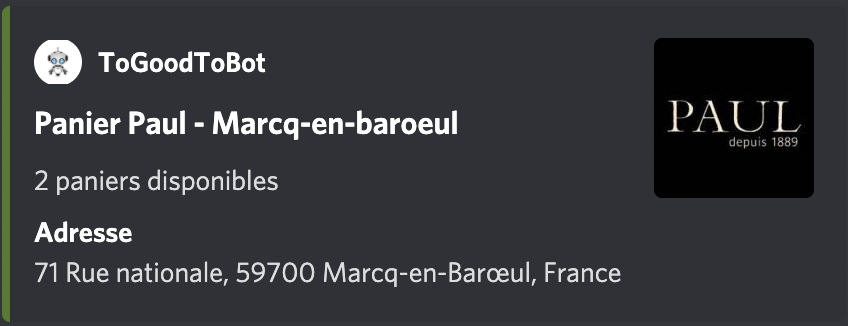
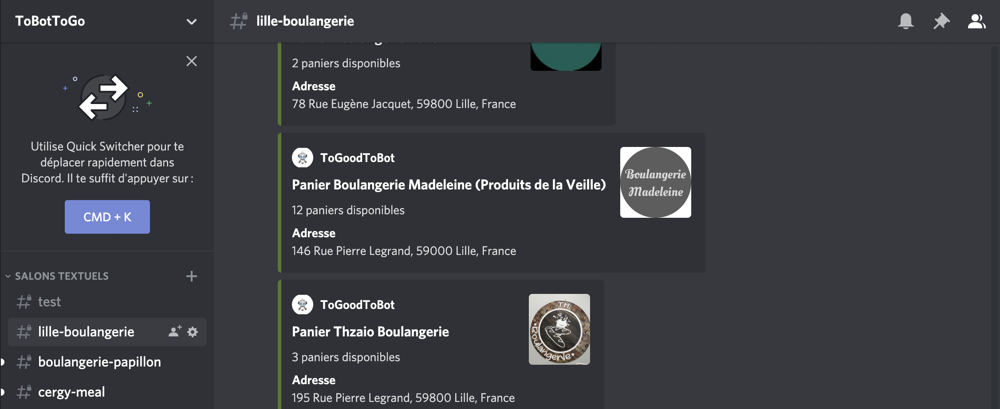

# To Good To Bot

This is a personal project, that I used in order to receive the latest available baskets in the mobile app **To Good To Go**.

This is an example of a card I received in my discord server that let my know that there are available baskets.

## Why this project ❓

First of all if you didn't know the mobile app To Good To Go, I highly recommend you to have a look at their [website](https://toogoodtogo.fr/fr) and to download their applications. (You will eat well 🍴 and save our planet ♻️).  
I developed this project because it isn't possible to set notifications in To Good To Go application. It begins to really annoyed me because I used to missed every baskets I wanted. I wanted a mean to be notified whenever a basket from a restaurant, bakery .. was available.

## The solution 💡

In this section I will explain to you the solution that came into my mind. Firstly, I explore the internal API of To Good To Go thanks to a proxy. Thanks to that I figure out how to do the following actions thanks to http requests :  

* login
* get baskets with specific filters :  
    * area
    * type of shop
    * ...

Then in order to be notified, I set up a discord server in which I create a new channel for every type of baskets I want. Then I built a discord bot that watch for available baskets and send a message whenever there is one.

Discord Channels            |  Card
:-------------------------:|:-------------------------:
  |  

## Technical details 💻

As I said earlier, I used a proxy in order to see the requests sent by my phone when I use the application. To do so I use [Charles application](https://www.charlesproxy.com)

For the discord bot, I developed it in **Python**.

Finally I host my discord bot on [Repl](https://replit.com) and I use a little trick to keep my bot alive 24h/24h.

## Keep in touch 🤝

You can contact me for several reasons :  

* want to contribute -> open an issue or send a pull request
* want to join the discord -> thibault#7473 (send me a private message)

Feel free to send me an email for any reason : thibaultspriet@outlook.fr